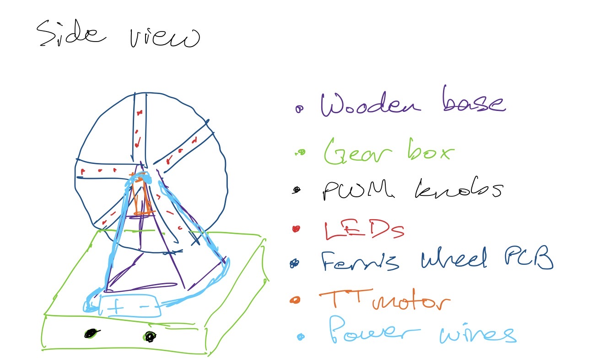
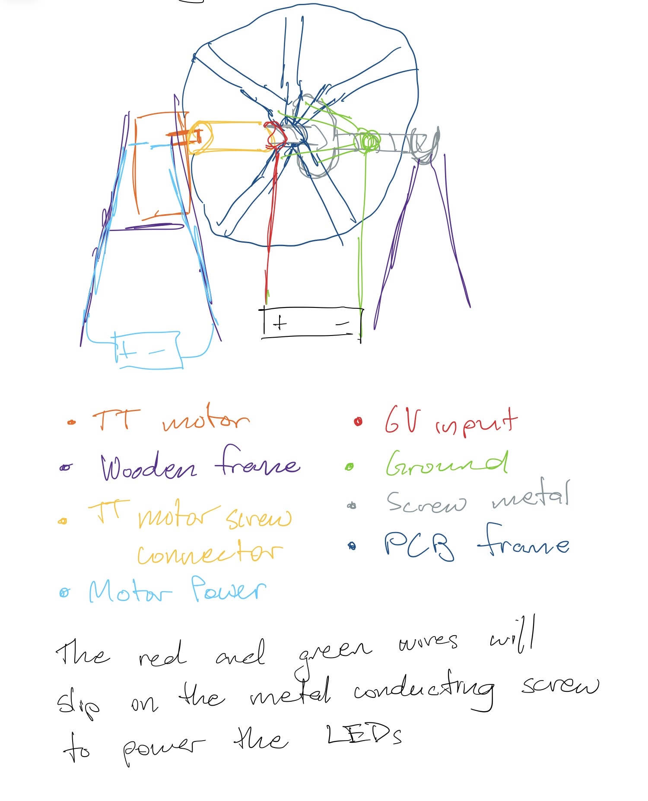
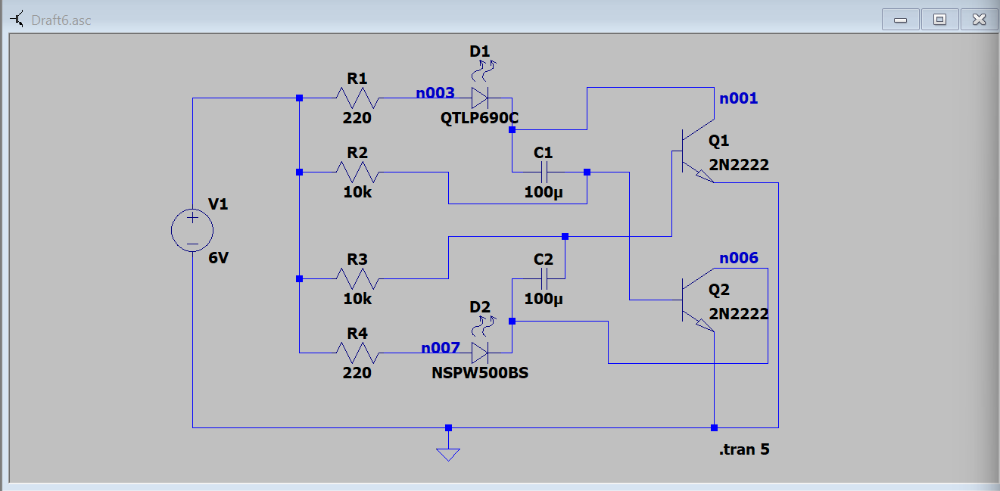
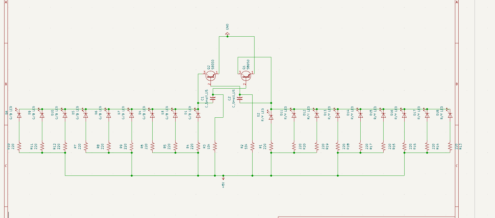
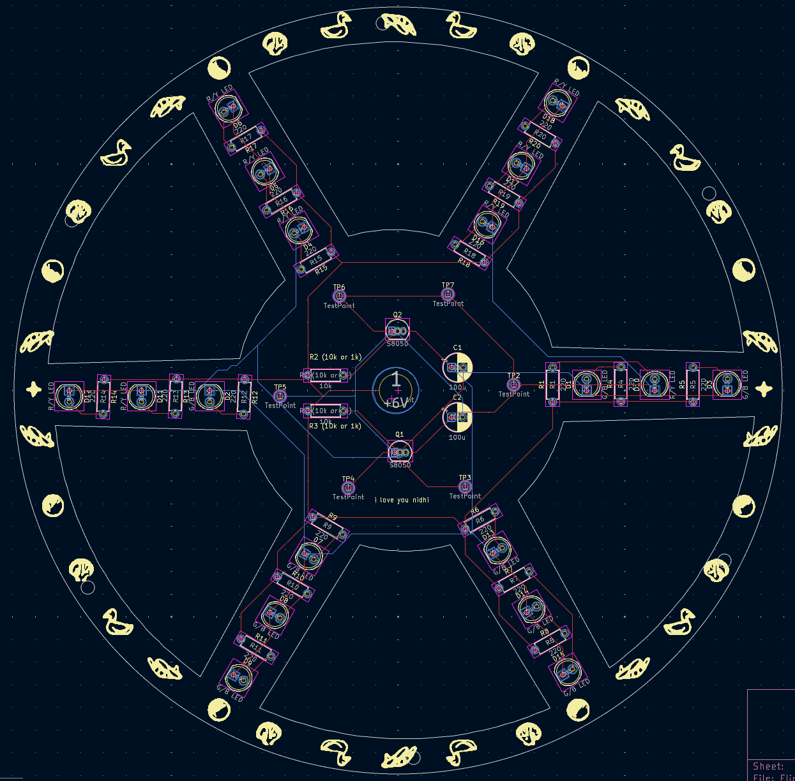
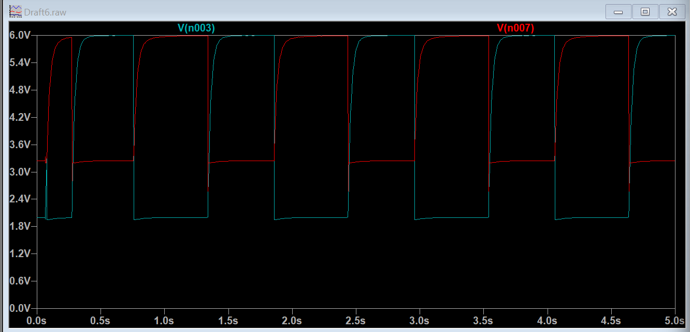
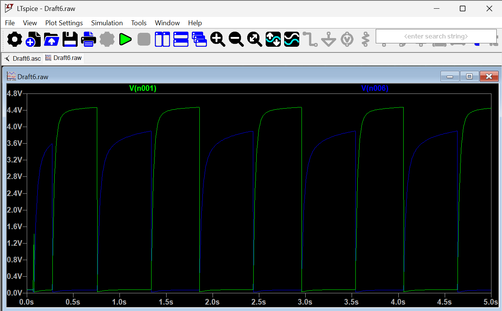

# Ferris-Wheel
Initially, the idea came from seeing a Ferris wheel and deciding that making it wouldn't be too challenging and a nice gift to close friends and family. As a result, I designed and manufactured an autonomous, 6.5-inch circular Ferris wheel PCB display with dynamic LED spoke illumination driven entirely by a free-running transistor flip-flop.

## Table of Contents

1. [Project Overview](#1-Project-Overview)
2. [Switching Logic](#2-Switching-Logic)
3. [PCB Layout with Scripting](#3-PCB-Layout-with-Scripting)
4. [LT Spice](#4-LT-Spice)
5. [Electrical Breakdown](#5-Electrical-Breakdown)
6. [Mechanical Breakdown](#6-Mechanical-Breakdown)
7. [Demo Video](#7-Demo-Video)
8. [What I Learned & Future Improvements](#8-What-I-Learned-&-Future-Improvements)

---

## 1. Project Overview

The idea for the project is to combine electrical and mechanical components to create an automated ferris wheel. Going from bottom to top, I have a 3D printed base that houses the flip-flop circuitry as well as batteries and other connections. Coming out of this base are two `BOJACK Low Voltage DC Motor Speed Controller PWM Adjustable Driver Switches`, one will control the brightness of the LEDs while the other will control the motor speed of the wheel. On top of the base, we have a hand-made wooden structure holding the `TT motor` that will turn the wheel. As the TT motor is plastic, I can't run current through it directly, so conveniently lying around the house I found a furniture adjuster (essentially a small saucer with a screw coming out of it). By making a custom TT motor to screw fastener, I am able to push the screw through the center of the wheel PCB to distribute the power that will come from the base to the screw shaft, while also allowing the screw to move in tandem with the TT motor. On the other side of the wheel PCB, I will glue together another furniture adjuster that will be connected to ground, also coming from the base. Hence, we complete the circuit and allow power to be supplied to the LEDs. Below is a list of the parts I used as well as their costs. Additionally, I have attached a rough sketch of the idea to help better understand.

| Component | Qty | Purpose | Approx. Cost |
|---|---|---|---|
| BOJACK Low Voltage DC Motor Speed Controller | 2 | Control LEDs and rotations | $7
| VWEICYY 2 AA Battery Holder | 2 | Power LEDs and motor | $2.75
| PCB custom order | 5 | Connecting all the LEDs and resistors in a neat, polished finish | ~$30
| Misc: Male to Male Wires, Batteries, Wood, Glue, 3D printing filament, LEDs, Resistors | — | Creating, connecting, and powering parts | ~$20

**Approximately $60 in total**

---

## 2. Switching Logic

The LEDs operate on a flip-flop logic using an S8050 transistor, two 100uF capacitors, two 10k/1k ohm resistors, and 18 220 ohm resistors. The S8050 transistor was used over other transistors due to its higher current handling and higher DC gain which is needed with the large load of 18 LEDs and resistors. Below is a scaled down schematic showcasing the general flipping logic (without all 18 LEDs). Here we have 10k ohm resistor as the base pull-up resistor, but with 18 LEDs it would be 1k ohm. 

---

## 3. PCB Layout with Scripting

Below is the actual PCB schematic along with its PCB design:

Aligning the LEDs, resistors, images, and creating the edge cuts was the hardest part of the actual PCB design process. I used scripting to declare an origin and create a matrix for the resistors and LEDs that they would circle around facing the center in pairs of three. Additionally, rotating the exact edge cut around the PCB required further scripting.

---

## 4. LT Spice

Below are images testing the voltages at the LEDs and collectors of the transistors. This proves the alternating logic of the circuit. The circuit used to test the voltages was displayed in section 2, the switching logic.

---

## 5. Electrical Breakdown

<!-- Learn the switching logic and include in depth breakdown -->
**Hardware Repository:** [KiCad and LTspice Source Files](./hardware)

Refer to the linked submodule for the PCB files!

---

## 6. Mechanical Breakdown

**CAD Repository:** [3D Models and Fabrication Files](./cad)

Refer to the linked submodule for the CAD files!

---

## 7. Demo Video

Demo video coming soon! Currently, I'm waiting for all the parts to come in, so I will post the video as soon as I get the parts and assemble the project.

---

## 8. What I Learned & Future Improvements

**Hardware Validation over Guesswork:** Originally, I had most of these parts at home, but I had to restart this project multiple times due to technical failures and attempting to do it without the PCB, which was completely impossible due to the amount of wires. When I actually got close to it working and had everything self-soldered, I forgot to put the resistors and as soon as I turned it on I fried every LED I had. I learned to constantly be testing it throughout the process because my mistake which fried the LEDs could've been easily prevented had I tested the LEDs separately earlier.
**EDA Automation:** Additionally, I learned a lot about python scripting to design PCBs. For this particular project, python scripting was necessary to get the correct rotation, geometric placement, and proper edge cuts. 
Moreover, applying classroom knowledge in RC circuits to design a flip-flop circuit helped me further understand transient responses and how to implement them. 

**Dynamic Slip Rings over Improvised Bushings:** For future improvements, having a slip screw would be infinitely better to prevent the unreliable solution of connecting power and grounding wires to screws, rather I would be able to just rotate the motor while also supplying the power through the same motor with a slip screw, guaranteeing that power won't falter due to a wire being loose or any other structural failures. 
**Motor Torque Issues:** Another improvement would be using a stronger torque motor. The TT motor's torque rating isn't as high as I want it to be and testing with the initial prototype caused too much strain on the motor, causing it to stop working. With the load I'm asking it to handle, I want it to rotate without problems the GA25-370 (25 mm Metal Spur Gearmotor) would be better suited with its compact size and stronger torque. Additionally, I wouldn't have to divide the power supplied for 3V for the motor and 6V for the LEDs; I could just supply 6V for both the LEDs and motor.

---

This project was very fun to make and I made it for someone very close to me as a gift (hence the imagery around the corners). Overall, I'm happy with how it turned out, but I still know there is stuff I could improve on, which I will take into consideration for future projects!

---

**Designed by Aditya Singh**  
*Undergraduate Student, Electrical and Computer Engineering — University of Texas at Austin (2026)*